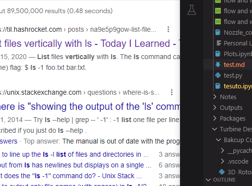

## all is well

test
'''
np.array
'''

> just type
> $$ Delta H = U4*Ct4 $$
> digunakan persamaan di atas untuk menentukan Ct4
> $ t $
<br> asd=
```
tesuto
```





why didn't work, I don't know

"markdown.preview.fontFamily": "-apple-system, BlinkMacSystemFont, 'Segoe WPC', 'Segoe UI', system-ui, 'Ubuntu', 'Droid Sans', sans-serif",

simple, right?
you should be able to see it right through.

just how

so sad

simple right?

not so simple

'''

tell me

'''

